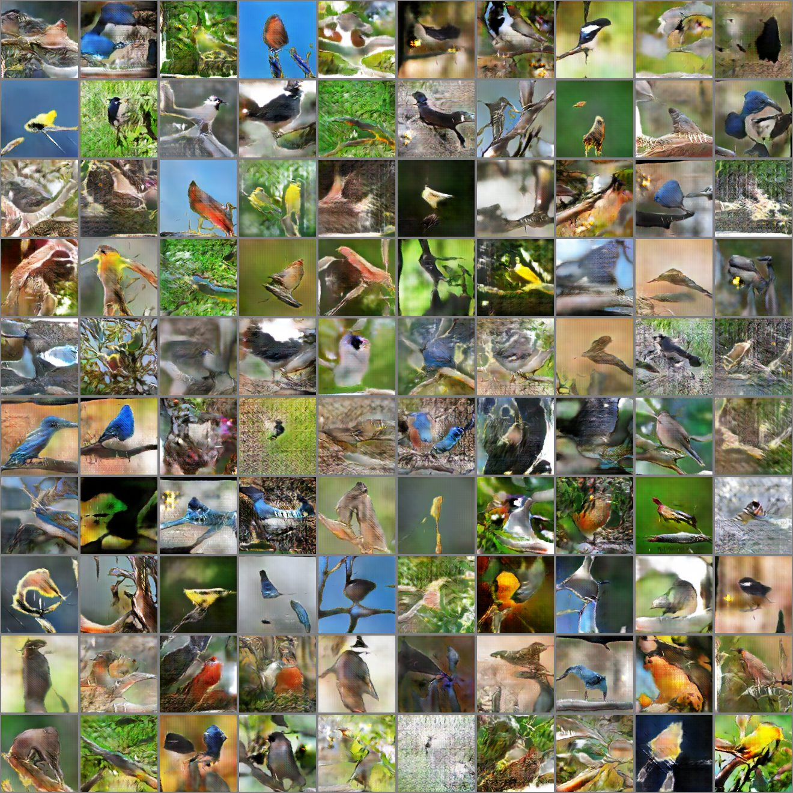
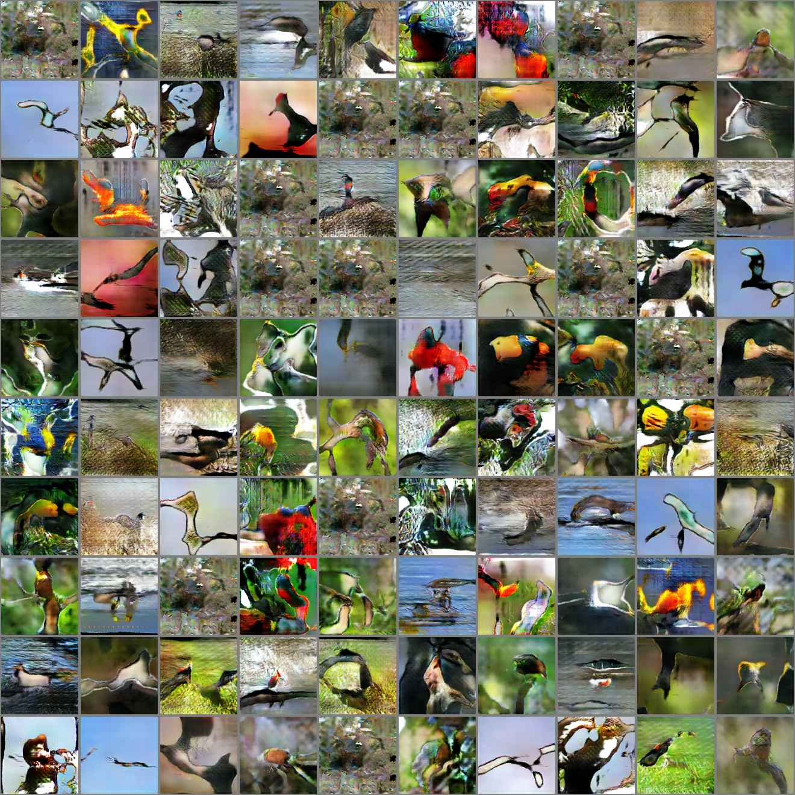
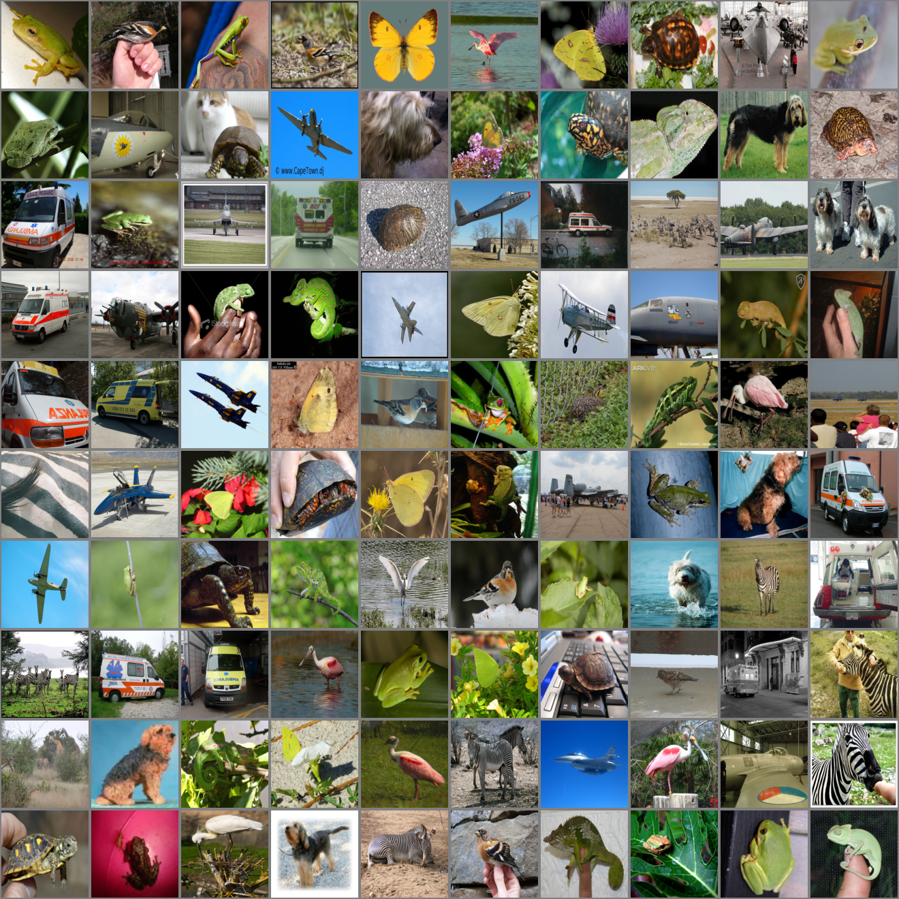
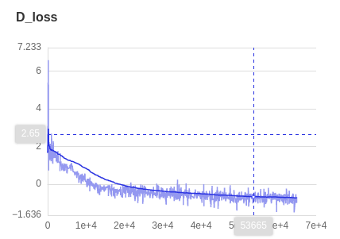
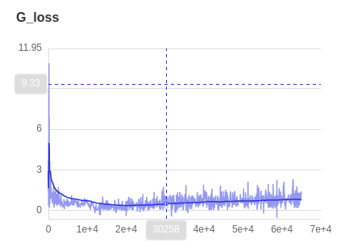

#### ACGAN-Paddle

基于Paddle复现2017 ICML论文[“Conditional Image Synthesis With Auxiliary Classifier GANs”](https://arxiv.org/abs/1610.09585)

该论文未开源代码，本次复现主要参考了以下两个非官方pytorch实现：

* [ACGAN-Pytorch](https://github.com/clvrai/ACGAN-PyTorch)

* [Pytorch-GAN](https://github.com/eriklindernoren/PyTorch-GAN)

#### 实现细节说明

* 遵循原文原则，将[ImageNet](https://image-net.org/)数据集每10个类别划分，训练一个10-classes的GAN模型
* 网络结构、训练超参数与原文一致


#### 预训练模型

本复现针对ImageNet抽取10个类别训练ACGAN， 总共训练了三个模型，分别使用了ImageNet 类别ID为10-20、100-110以及随机抽取10个类别，预训练模型见[百度网盘链接](https://pan.baidu.com/s/1ol4sY2-MAyDZPIyWdwomxA)( 提取码: ce8r )其中每个文件夹内有三个文件，分别是生成器模型参数、判别器模型参数以及该组实验对应的log, 请将预训练模型置于[checkpoints](./checkpoints)目录下,测试时设置对应的文件夹路径。


#### 训练与测试方式

* 训练

```python
python trian.py --dataroot [imagenet path] # [eg:xxx/ImageNet/train]
```

* 测试

```python
python test.py --check_path [checkpoints path] --which_epoch [epoch]
```

* 查看日志

```python
visuldl --logdir ./log
```


#### 视觉结果对比

* 生成的图像与真实图像(ImageNet class 10-20)

  |                      Fake Samples(Ours)                      |                 Fake Samples(ACGAN-Pytorch)                  |                         Real Samples                         |
  | :----------------------------------------------------------: | :----------------------------------------------------------: | :----------------------------------------------------------: |
  |  |  |  |

  

* 更多类别结果对比(class id:100-100,  随机挑选10类别)

  |           类别           |                        fake_samples1                         |                        fake_samples2                         |                         fake_sample3                         |                         real_samples                         |
  | :----------------------: | :----------------------------------------------------------: | :----------------------------------------------------------: | :----------------------------------------------------------: | :----------------------------------------------------------: |
  |   **classes 100-100**    |  |  |  |  |
  | **random   10-classess** |  |  |  |  |

  

  #### 训练Log示意（class id:10-20）
  
  | Accuracy                                                  | D Loss                                                       | G Loss                                                       |
  | --------------------------------------------------------- | ------------------------------------------------------------ | ------------------------------------------------------------ |
  |  |  |  |
  
  
  
  


