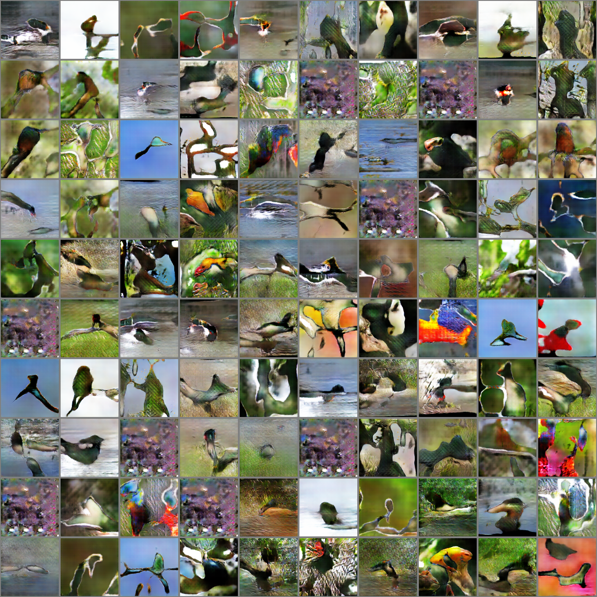
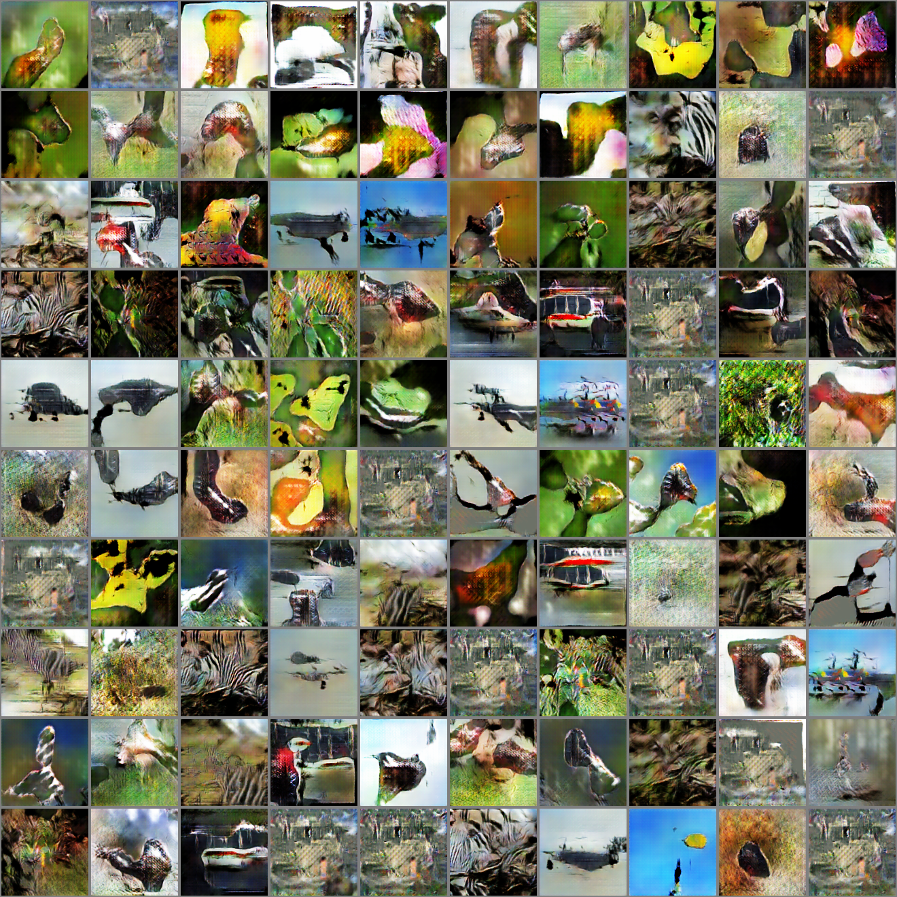
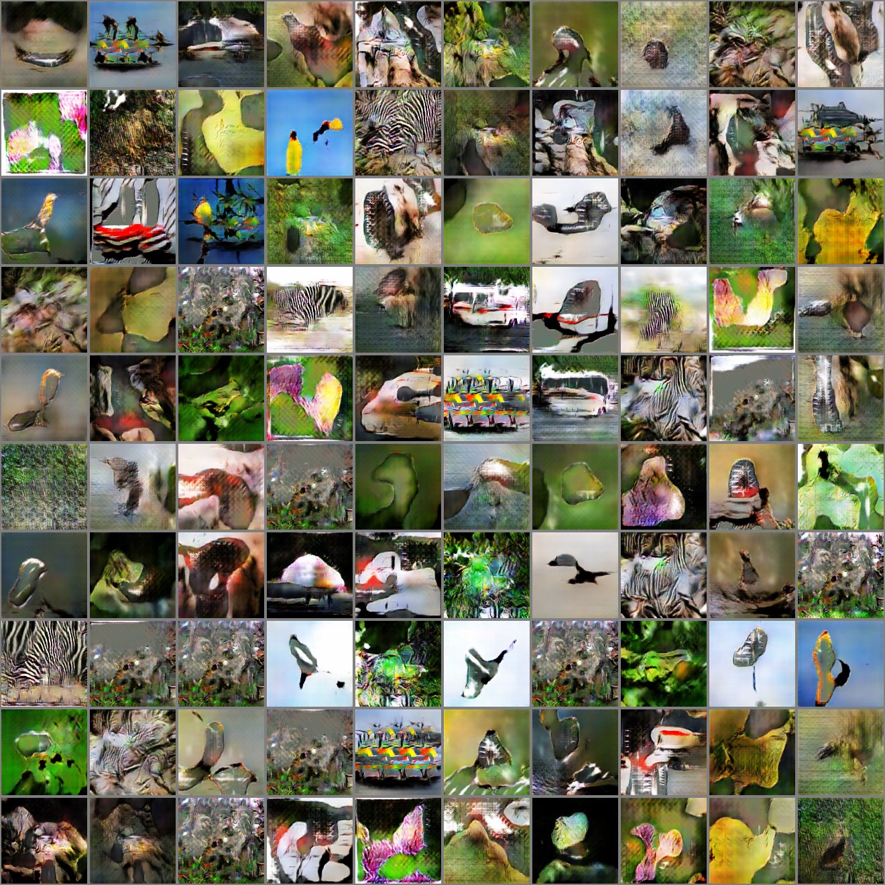

#### ACGAN-Paddle

基于Paddle复现2017 ICML论文[“Conditional Image Synthesis With Auxiliary Classifier GANs”](https://arxiv.org/abs/1610.09585)

该论文未开源代码，本次复现主要参考了以下两个非官方pytorch实现：

* [ACGAN-Pytorch](https://github.com/clvrai/ACGAN-PyTorch)

* [Pytorch-GAN](https://github.com/eriklindernoren/PyTorch-GAN)

#### 实现细节说明

* 遵循原文原则，将[ImageNet](https://image-net.org/)数据集每10个类别划分，训练一个10-classes的GAN模型
* 网络结构、训练超参数与原文一致

#### 训练与测试方式

* 训练

```python
python trian.py --dataroot [imagenet path] # [eg:xxx/ImageNet/train]
```

* 测试

```python
python test.py --which_epoch [epoch]
```

* 查看日志

```python
visuldl --logdir ./log
```


#### 视觉结果对比

* 生成的图像与真实图像(ImageNet class 10-20)

  |            Fake Samples(Ours)            |           Fake Samples(ACGAN-Pytorch)            |               Real Samples               |
  | :--------------------------------------: | :----------------------------------------------: | :--------------------------------------: |
  |  |  |  |

  

* 更多类别结果对比(class id:100-100,  随机挑选10类别)

  |           类别           |                 fake_samples1                 |                 fake_samples2                 |                 fake_sample3                  |                 real_samples                 |
  | :----------------------: | :-------------------------------------------: | :-------------------------------------------: | :-------------------------------------------: | :------------------------------------------: |
  |   **classes 100-100**    |         |  ****   |  ****   |   ****   |
  | **random   10-classess** |  |  |  |  |

  

  #### 训练Log示意（class id:10-20）
  
  | Accuracy                | D Loss                     | G Loss                     |
  | ----------------------- | -------------------------- | -------------------------- |
  |  |  |  |
  
  
  
  


