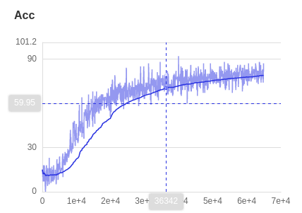
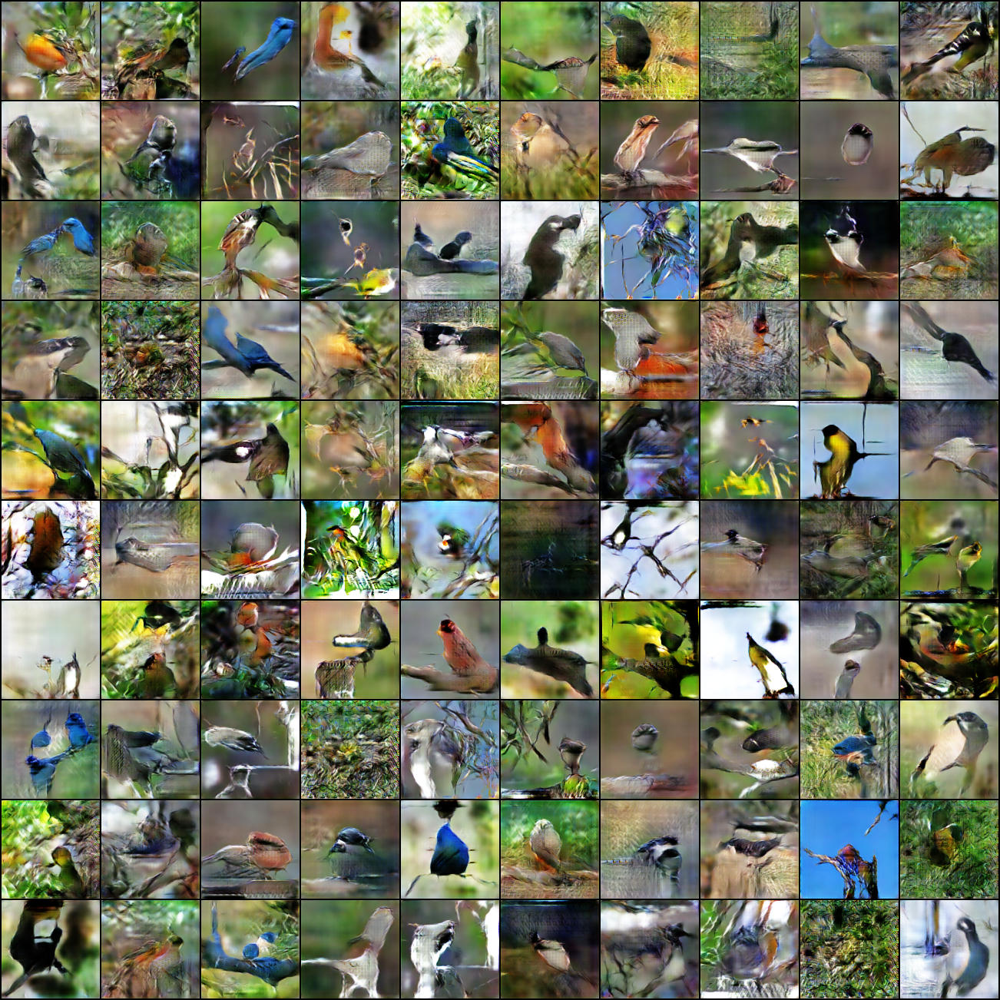
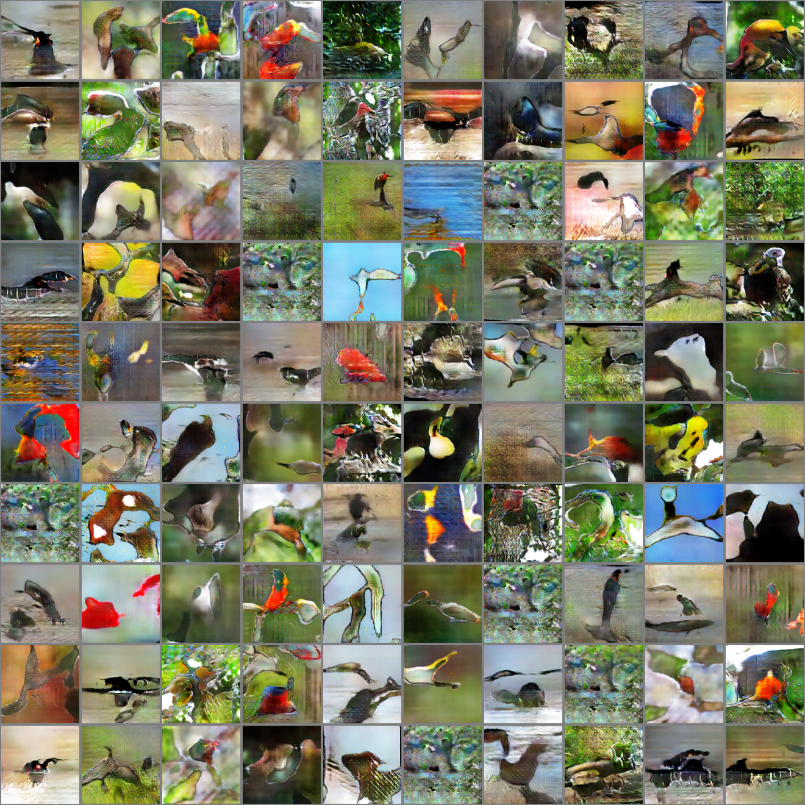
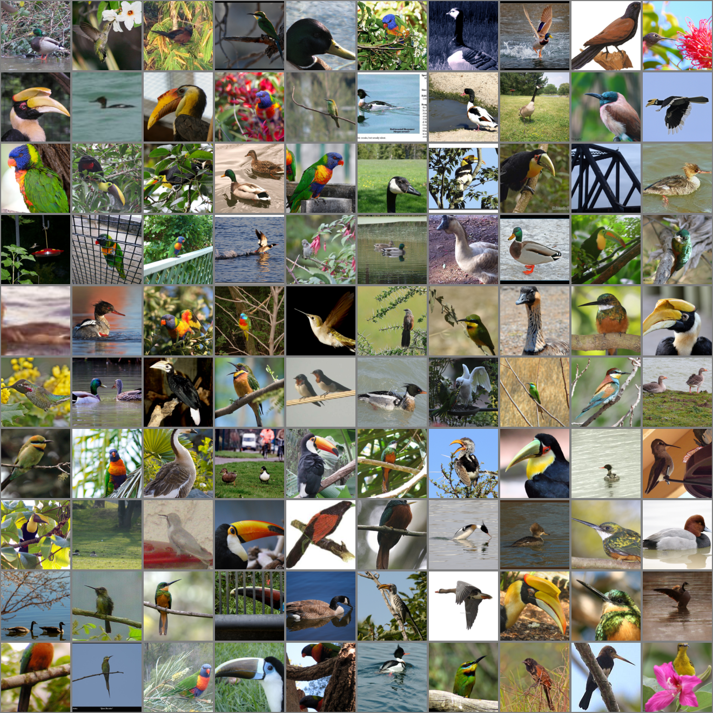
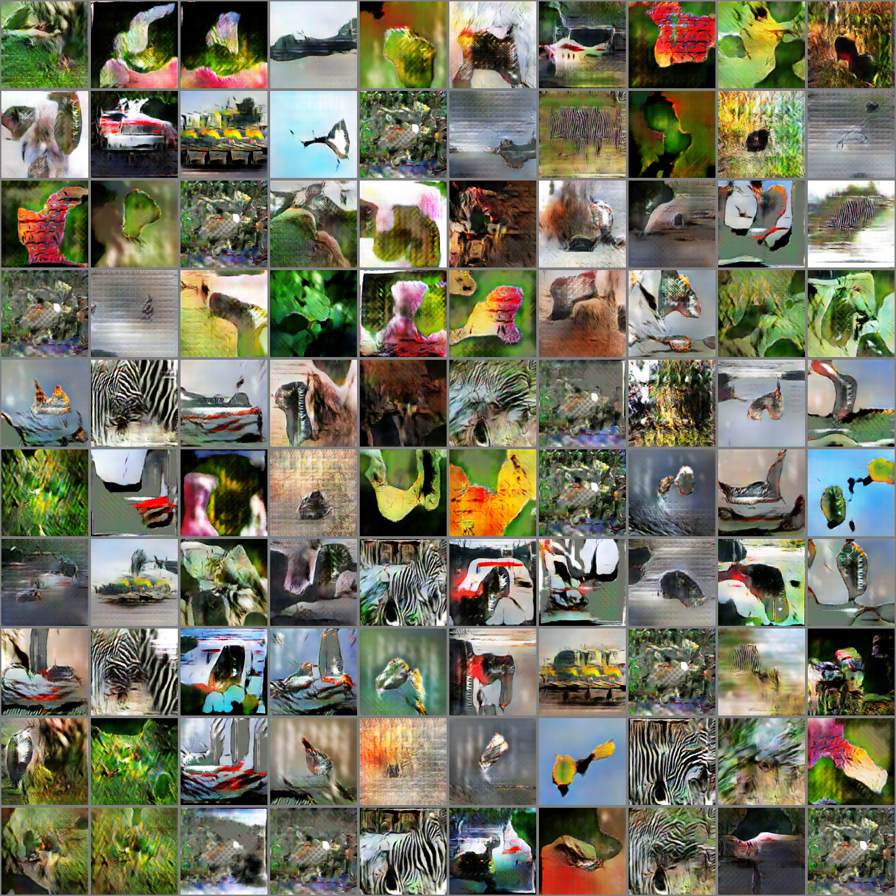

# ACGAN-Paddle

English| [简体中文](./README_cn.md)

* [ACGAN-Paddle]()
  * [1. Introduction](#1-Introduction)
  * [2. Acdcuracy](#2-Accuracy)
  * [3. Dataset](#3-Dataset)
  * [4. Dependency](#4-Dependency)
  * [5. Quick Start](#5. Quick Start)
    * [step1:Colne](#step1Clone)
    * [step2:Training](#step2Training)
    * [step3:Testing](#step3Testing)
    * [Check Log](#check-log)
    * [Pre-trained model](# Pre-trained model)
  * [6. Code Structure and Description](#6-Code Structure and Description)
    * [6.1 code structure](#61-code structure)
    * [6.2 description](#62-description)
  * [7. Results](#7-Results)
  * [8. Model Information](#8-Model-Information)

## 1. Introduction


This project is based on the PaddlePaddle replication paper "**Conditional Image Synthesis with Auxiliary Classifier GANs**"(ACGAN), which focuses on adding an auxiliary discriminator to a conditional generative adversarial network (Conditional GAN) to guide the image generation process. The main work of this paper is to add an auxiliary discriminator to conditional generative adversarial networks (CGAs) to guide the image generation process by adding a classification layer to the discriminator of the model to force the generated image classes to be as close as possible to the input labels. Experimentally, ACGAN has been shown to perform well in synthesizing high-resolution images.

**Paper**

* [[1] Odena, A. , C. Olah , and J. Shlens . "Conditional Image Synthesis With Auxiliary Classifier GANs." (2016).

**Projects**

Since the authors did not release the source code, the following unofficial implementation was referenced for this project.

* [ACGAN-Pytorch](https://github.com/clvrai/ACGAN-PyTorch)
* [Pytorch-GAN](https://github.com/eriklindernoren/PyTorch-GAN)

**Online Operation**

* Ai Studio job project：[ACGAN-Paddle](https://aistudio.baidu.com/aistudio/clusterprojectdetail/2417917)


## 2. Accuracy

This replication did not involve metrics measurement, and the main goal was to generate images that could be close to the real sample in terms of visual assessment, so the following shows the randomly generated sample and the real sample.

|                         fake samples                         |                         real samples                         |
| :----------------------------------------------------------: | :----------------------------------------------------------: |
|  |  |


## 3. Dataset

The dataset in the paper is [ImageNet](https://image-net.org/), and the dataset is organized in the following format.

* Training set: 1279591 images
* Validation set: 50000 images
* Testing set: 10000 images

According to the setup in the paper, 1000 image categories are grouped and one group of 10 categories is used to train a model. Three different sets of experiments were performed for this replication.

* 10,000 images of image category number 10-20 as the training set
* 10,000 images of image category number 100-100 as training set
* Randomly selected 10 categories with 10,000 images as the training set

## 5. Dependency

* Hardware：GPU、CPU
* Framework：PaddlePaddle>=2.0.0


## 5. Quick Start

### Clone

```python
git https://github.com/Callifrey/ACGAN-Paddle.git
cd ACGAN-Paddle
```

### Training

```python
python trian.py --dataroot [imagenet path] # [eg:xxx/ImageNet/train]
```

### Testing

```python
python test.py --check_path [checkpoints path] --which_epoch [epoch]
```

### Check Log

```python
visuldl --logdir ./log
```

Pretrained Models


### Prediction with pre-trained mode

The pre-training model is available at [Baidu Drive](https://pan.baidu.com/s/1ol4sY2-MAyDZPIyWdwomxA)( Extraction code: ce8r ) where there are three files in each folder, which are the generator model parameters, the discriminator model parameters and the log corresponding to the group of experiments, please place the pre-training model in [ checkpoints](. /checkpoints) directory, and set the path of the corresponding folder when testing.

## 6. Code structure and description

### 6.1 code structure

```python
├─checkpoints                     # dir for saving models
├─imgs                            # dir for saving images
├─log                             # logging files
├─results                         # dir for generated images
│  README.md                      # English readme
│  README_cn.md                   # Chinese readme
│  dataset.py                     # Class for dataset
│  network.py                     # Architecture for model
│  train.py                       # Training script
│  test.py                        # Testing script
│  utils.py                       # Tool classes
```

### 6.2 参数说明

* **train.py** 参数说明(部分)

  | 参数              | 默认值                                             | 说明                           |
  | ----------------- | -------------------------------------------------- | ------------------------------ |
  | **--dataroot**    | str: ‘/media/gallifrey/DJW/Dataset/Imagenet/train’ | Path for training set          |
  | **--workers**     | int : 4                                            | Number of threads              |
  | **--batchSize**   | int: 100                                           | Start checkpoint               |
  | **--imageSize**   | int: 128                                           | Size of load / generate images |
  | **--nz**          | int: 110                                           | Dimension for latent           |
  | **--ngf**         | int: 64                                            | Scale for channels of G        |
  | **--ndf**         | int: 5                                             | Scale for channels of D        |
  | **--lr**          | float: 0.0002                                      | Initial learning rate          |
  | **--beta1**       | float: 0.5                                         | Beta param for optimizer       |
  | **--check_path**  | str: './checkpoints'                               | Path for chekpoints            |
  | **--result_path** | str：'./result'                                    | Path for results               |
  | **--log_path**    | str: './log'                                       | Path for log file              |
  | **--save_freq**   | int: 5                                             | Save frequency                 |
  | **--num_classes** | int: 10                                            | Number of clasess              |
  | **--niter**       | int: 500                                           | Number of training epoches     |


* **test.py** 参数说明(部分)

  | 参数              | 默认值               | 说明                                   |
  | ----------------- | -------------------- | -------------------------------------- |
  | **--batchSize**   | int: 100             | Number of samole for testing one batch |
  | **--nz**          | int: 110             | Dimension of latent                    |
  | **--check_path**  | str: './checkpoints' | Path for checkpoints                   |
  | **--imageSize**   | int: 128             | Size of load / generate images         |
  | **--result_path** | str：'./result'      | Path for results                       |
  | **--num_classes** | int: 10              | Number of classes                      |
  | **--which_epoch** | int: 499             | IModel ID for testing                  |

  


## 7. Results

### 7.1 Training loss (class id 10-20)

| Accuracy                                                  | D Loss                                                       | G Loss                                                       |
| --------------------------------------------------------- | ------------------------------------------------------------ | ------------------------------------------------------------ |
|  |  |  |

### 7.2 Visual Comparison

* Fake samples VS Real samples

|                      Fake samples(Ours)                      | Fake samples([ACGAN-Pytorch](https://github.com/clvrai/ACGAN-PyTorch)) |                         Real samples                         |
| :----------------------------------------------------------: | :----------------------------------------------------------: | :----------------------------------------------------------: |
|  |  |  |

* More results

  |         Class         |                        Fake samples 1                        |                        Fake samples 2                        |                        Fake samples 3                        |                         Real samples                         |
  | :-------------------: | :----------------------------------------------------------: | :----------------------------------------------------------: | :----------------------------------------------------------: | :----------------------------------------------------------: |
  |  **Classes 100-110**  |  |  |  |  |
  | **Random 10 classes** |  |  |  |  |

## 8. Model Information

Additional information about the model can be found in the following table:

| Information           | Description                                                  |
| --------------------- | ------------------------------------------------------------ |
| Author                | Dai Jiawu                                                    |
| Date                  | 2021.09                                                      |
| Framework version     | Paddle 2.0.2                                                 |
| Application scenarios | Image Generation                                             |
| Supported Hardware    | GPU、CPU                                                     |
| Download link         | [Pre-trained models](https://pan.baidu.com/s/1ol4sY2-MAyDZPIyWdwomxA ) (code：ce8r) |
| Online operation      | [Scripts](https://aistudio.baidu.com/aistudio/clusterprojectdetail/2417917) |

