# ACGAN-Paddle

[English](./README.md) | 简体中文

* [ACGAN-Paddle]()
  * [一、简介](#一简介)
  * [二、复现精度](#二复现精度)
  * [三、数据集](#三数据集)
  * [四、环境依赖](#环境依赖)
  * [五、快速开始](#五快速开始)
    * [step1:克隆](#克隆)
    * [step2:训练](#训练)
    * [step3:测试](#测试)
    * [查看日志](#查看日志)
    * [预训练模型](#预训练模型)
  * [六、代码结构与详细说明](#六代码结构与详细说明)
    * [6.1 代码结构](#61-代码结构)
    * [6.2 参数说明](#62-参数说明)
  * [七、结果展示](#七结果展示)
  * [八、模型信息]()


## 一、简介

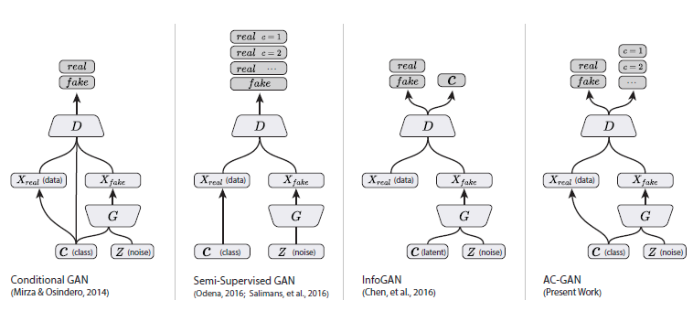

本项目是基于PaddlePaddle复现论文**《Conditional Image Synthesis with Auxiliary Classifier GANs》**（ACGAN), 该论文的主要工作是向条件式生成对抗网络（Conditional GAN）中加入辅助判别器来指导图像生成过程，具体的做法是在模型的判别器中加入分类层来强迫生成的图像类别与输入的标签尽可能接近。实验证明，ACGAN在合成高分辨的图像时表现良好。

**论文**

* [1] Odena, A. , C. Olah , and J. Shlens . "Conditional Image Synthesis With Auxiliary Classifier GANs." (2016).

**参考项目**

由于作者并未开源代码，所以本项目参考了以下非官方实现：

* [ACGAN-Pytorch](https://github.com/clvrai/ACGAN-PyTorch)
* [Pytorch-GAN](https://github.com/eriklindernoren/PyTorch-GAN)

**在线运行**

* Ai Studio 脚本项目：[ACGAN-Paddle](https://aistudio.baidu.com/aistudio/clusterprojectdetail/2417917)


## 二、复现精度

本次复现未涉及指标测评，主要目标是生成图像能够在肉眼评估上与真实的样本接近，故以下展示了随机生成的样本和真实样本：

|                           生成样本                           |                           真实样本                           |
| :----------------------------------------------------------: | :----------------------------------------------------------: |
| 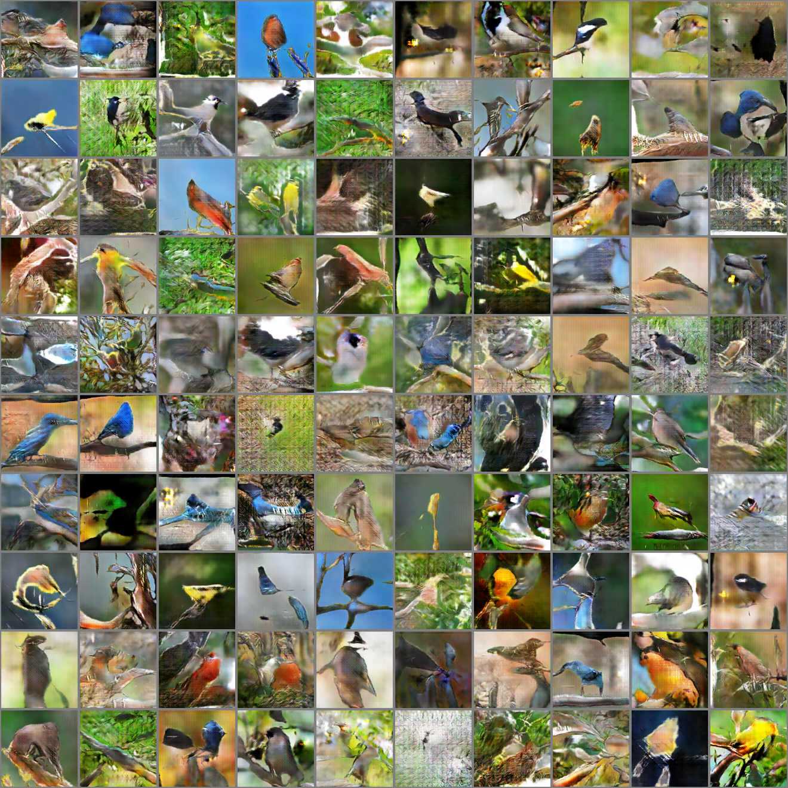 | 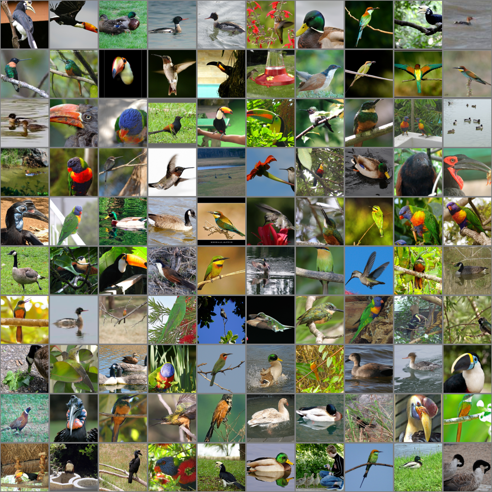 |


## 三、数据集

论文中的数据集是[ImageNet](https://image-net.org/), 数据集的组织格式如下：

* 训练集：1279591张图像
* 验证集：50000张图像
* 测试集：10000张图像

按照论文中的设置，将1000个图像类别分组，每10个类别一组用来训练一个模型。本次复现共进行三组不同实验：

* 图像类别序号为10-20共10000张图像作为训练集
* 图像类别序号为100-100共10000张图像作为训练集
* 随机挑选10个类别共10000张图像作为训练集


## 四、环境依赖

* 硬件：GPU、CPU
* 框架：PaddlePaddle>=2.0.0


## 五、快速开始

### 克隆

```python
git https://github.com/Callifrey/ACGAN-Paddle.git
cd ACGAN-Paddle
```

### 训练

```python
python trian.py --dataroot [imagenet path] # [eg:xxx/ImageNet/train]
```

### 测试

```python
python test.py --check_path [checkpoints path] --which_epoch [epoch]
```

### 查看日志

```python
visuldl --logdir ./log
```

### 预训练模型

​        预训练模型见[百度网盘链接](https://pan.baidu.com/s/1ol4sY2-MAyDZPIyWdwomxA)( 提取码: ce8r )其中每个文件夹内有三个文件，分别是生成器模型参数、判别器模型参数以及该组实验对应的log, 请将预训练模型置于[checkpoints](./checkpoints)目录下,测试时设置对应的文件夹路径。


## 六、代码结构与详细说明

### 6.1 代码结构

```python
├─checkpoints                     # 保存模型
├─imgs                            # 保存各类图像
├─log                             # 保存入职文件
├─results                         # 保存生成结果
│  README.md                      # 英文readme
│  README_cn.md                   # 中文readme
│  dataset.py                     # 数据集类
│  network.py                     # 模型结构
│  train.py                       # 训练
│  test.py                        # 测试
│  utils.py                       # 部分工具类
```

### 6.2 参数说明

* **train.py** 参数说明(部分)

  | 参数              | 默认值                                             | 说明                      |
  | ----------------- | -------------------------------------------------- | ------------------------- |
  | **--dataroot**    | str: ‘/media/gallifrey/DJW/Dataset/Imagenet/train’ | 训练集路径                |
  | **--workers**     | int : 4                                            | 数据加载子进程数量        |
  | **--batchSize**   | int: 100                                           | 开始训练的断点            |
  | **--imageSize**   | int: 128                                           | 读取/生成图像尺寸         |
  | **--nz**          | int: 110                                           | 随机噪声维度              |
  | **--ngf**         | int: 64                                            | 生成器通道数基数          |
  | **--ndf**         | int: 5                                             | 判别器通道数基数          |
  | **--lr**          | float: 0.0002                                      | 初始学习率                |
  | **--beta1**       | float: 0.5                                         | 优化器参数                |
  | **--check_path**  | str: './checkpoints'                               | 模型保存路径              |
  | **--result_path** | str：'./result'                                    | 结果保存路径              |
  | **--log_path**    | str: './log'                                       | 日志保存路径              |
  | **--save_freq**   | int: 5                                             | 每隔几个epoch保存一次模型 |
  | **--num_classes** | int: 10                                            | 图像类别                  |
  | **--niter**       | int: 500                                           | 训练的epoch               |


* **test.py** 参数说明(部分)

  | 参数              | 默认值               | 说明              |
  | ----------------- | -------------------- | ----------------- |
  | **--batchSize**   | int: 100             | 测试时的样本数量  |
  | **--nz**          | int: 110             | 随机噪声维度      |
  | **--check_path**  | str: './checkpoints' | 模型保存路径      |
  | **--imageSize**   | int: 128             | 读取/生成图像尺寸 |
  | **--result_path** | str：'./result'      | 结果保存路径      |
  | **--num_classes** | int: 10              | 图像类别          |
  | **--which_epoch** | int: 499             | 测试模型序号      |

  

## 七、结果展示

### 7.1 训练Loss（类别序号：10-20）

| Accuracy                                                  | D Loss                                                       | G Loss                                                       |
| --------------------------------------------------------- | ------------------------------------------------------------ | ------------------------------------------------------------ |
| 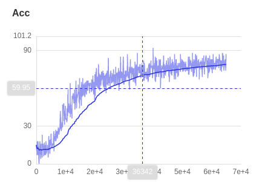 | 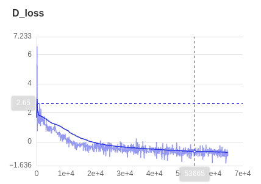 | 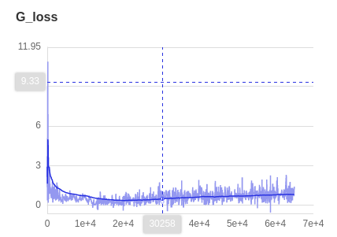 |

### 7.2 视觉效果对比

#### 视觉结果对比

* 生成的图像与真实图像(类别序号 10-20)

  |                         生成的假样本                         | [参考实现](https://github.com/clvrai/ACGAN-PyTorch)生成的假样本 |                           真实样本                           |
  | :----------------------------------------------------------: | :----------------------------------------------------------: | :----------------------------------------------------------: |
  |  | 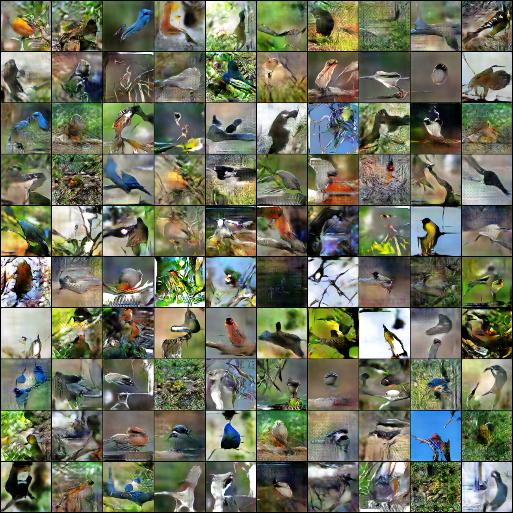 |  |

  

* 更多类别结果对比

  |        类别         |                           假样本1                            |                           假样本2                            |                           假样本3                            |                           真实样本                           |
  | :-----------------: | :----------------------------------------------------------: | :----------------------------------------------------------: | :----------------------------------------------------------: | :----------------------------------------------------------: |
  | **100-110序号类别** | 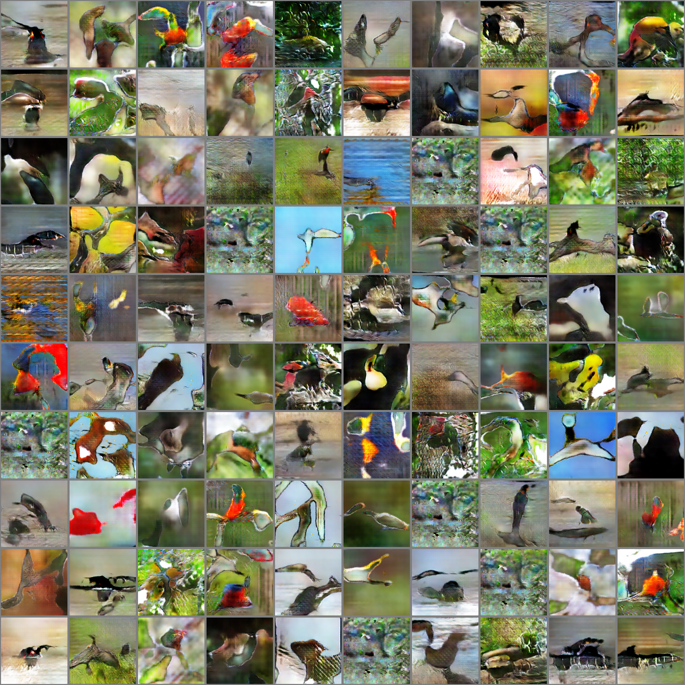 | 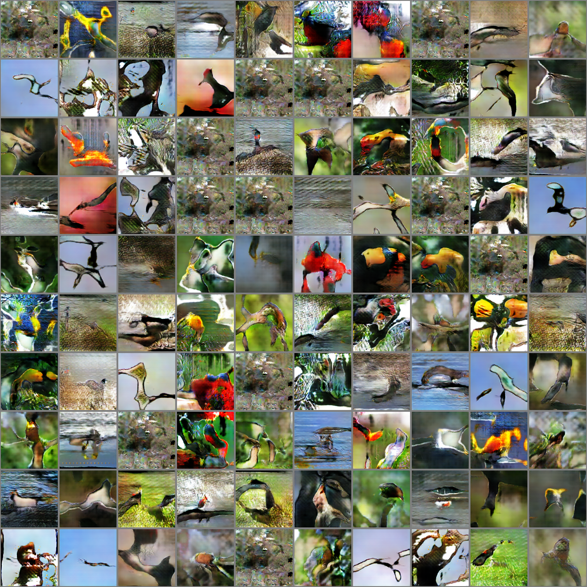 | 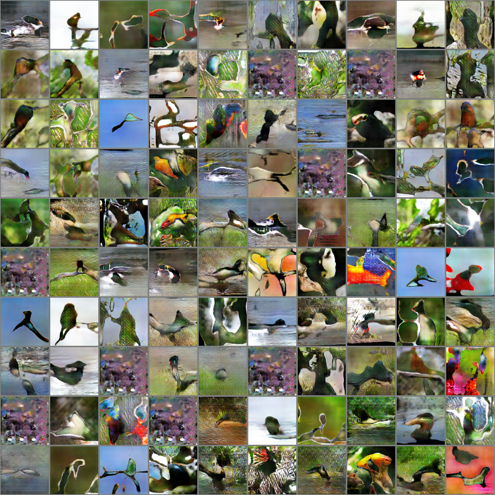 | 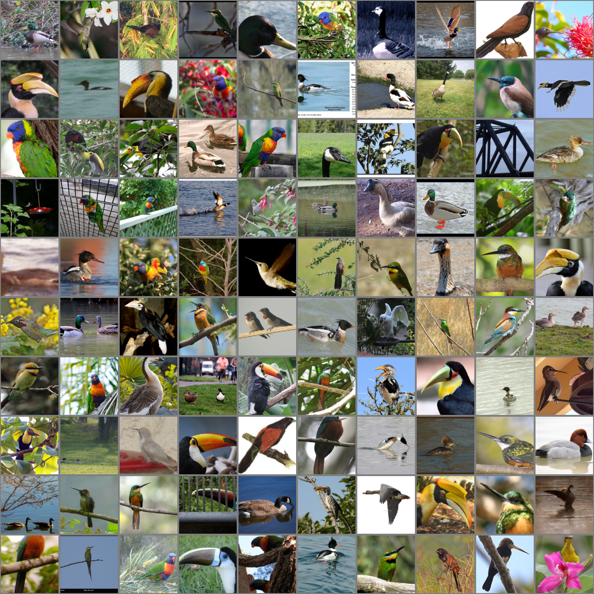 |
  |   **随机10类别**    | 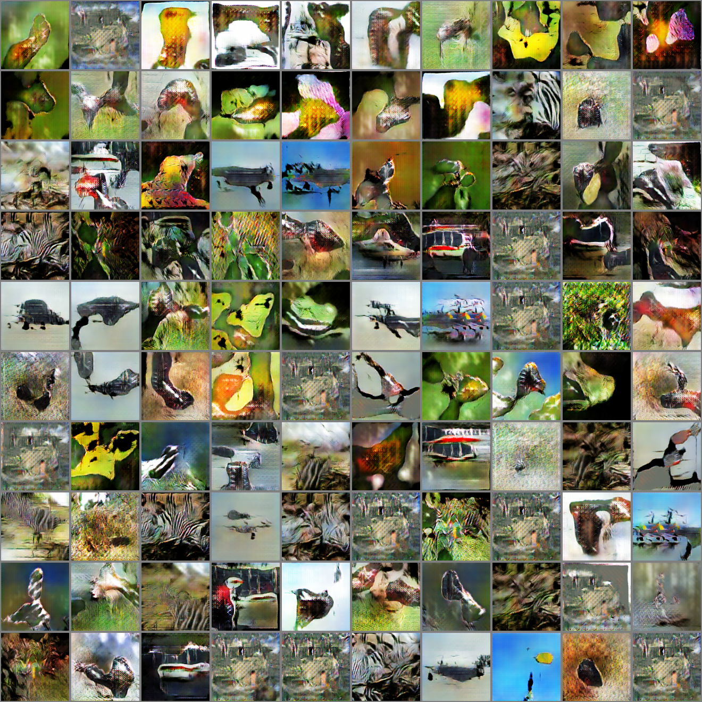 | 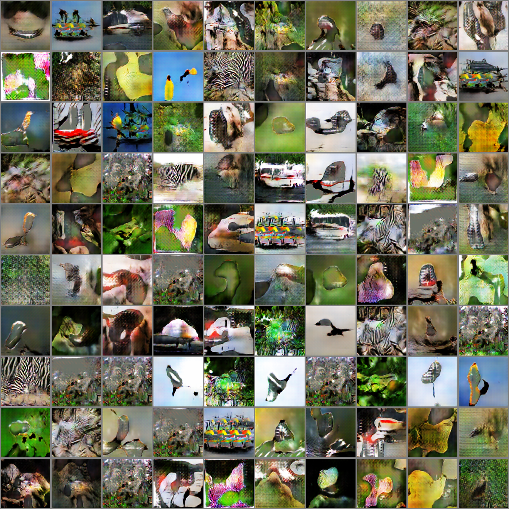 | 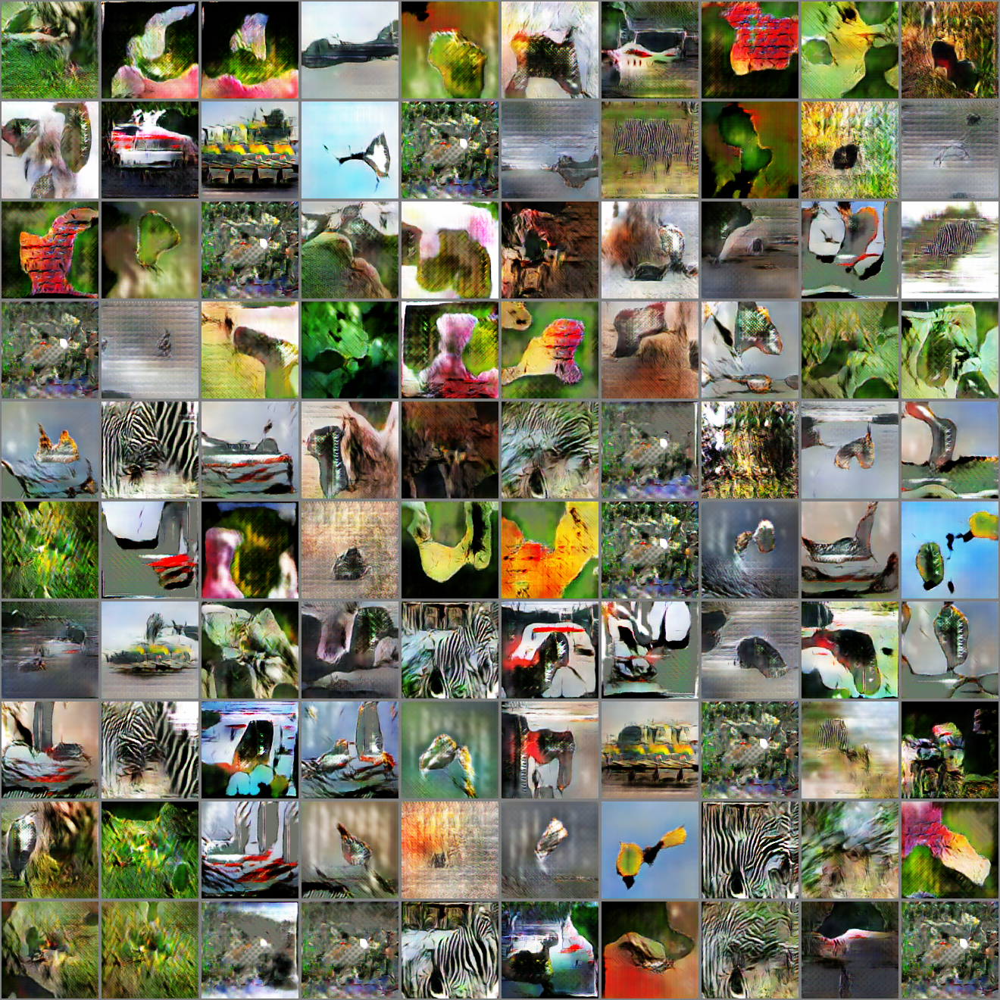 | 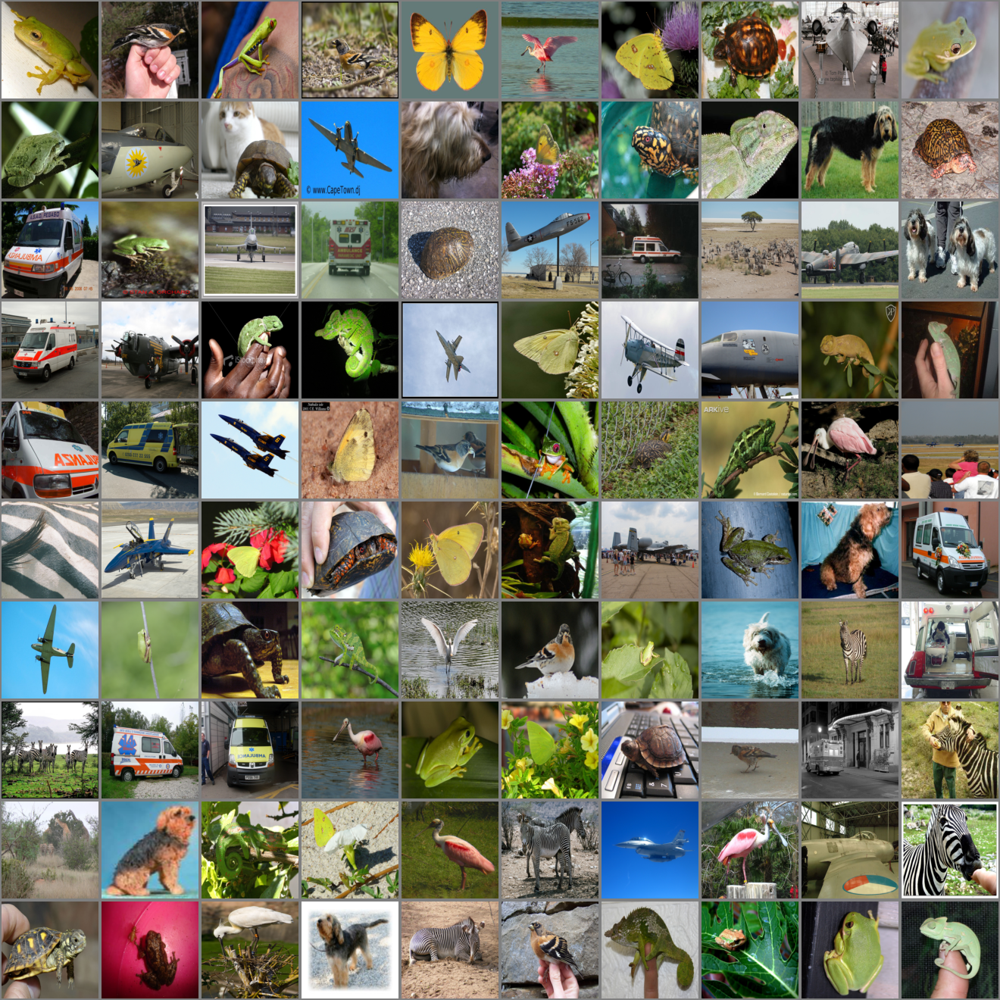 |


## 八、模型信息

关于模型的其他信息，可以参考下表：

| 信息     | 说明                                                         |
| -------- | ------------------------------------------------------------ |
| 发布者   | 戴家武                                                       |
| 时间     | 2021.09                                                      |
| 框架版本 | Paddle 2.0.2                                                 |
| 应用场景 | 图像生成                                                     |
| 支持硬件 | GPU、CPU                                                     |
| 下载链接 | [预训练模型](https://pan.baidu.com/s/1ol4sY2-MAyDZPIyWdwomxA) (提取码：ce8r) |
| 在线运行 | [脚本任务](https://aistudio.baidu.com/aistudio/clusterprojectdetail/2417917) |

